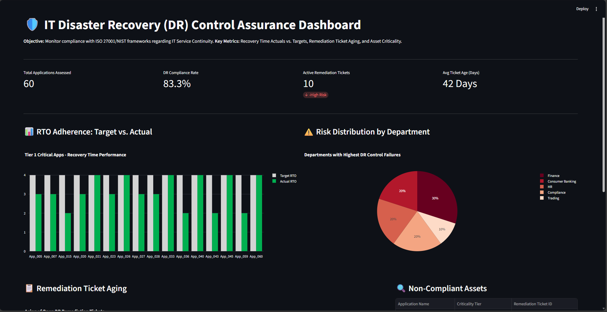
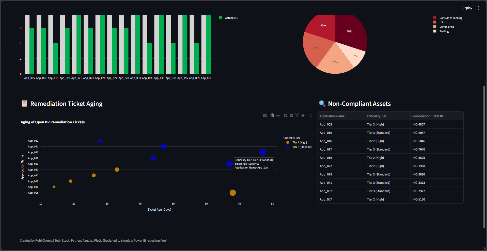

# IT Disaster Recovery (DR) Compliance & Control Assurance Dashboard

### Project Overview
This project is a **Control Assurance prototype** designed to streamline the monitoring of IT Disaster Recovery (DR) risks. It automates the analysis of Recovery Time Objectives (RTO) vs. Actuals and tracks remediation ticket aging.

The tool was built to demonstrate how **Information Risk Management (IRM)** teams can move from manual spreadsheet tracking to automated, real-time risk visualization.

### 🎯 Relevance to Information Risk Management
In the context of **Control Assurance (ISO 27001 / NIST)**, this dashboard solves three key problems:
1.  **Gap Analysis:** Instantly highlights applications where *Actual Recovery Time* exceeds the *Target RTO* (Compliance Failure).
2.  **Remediation Tracking:** Identifies "stale" risk tickets (e.g., open > 90 days) to prioritize automated escalation.
3.  **Asset Inventory Risk:** Correlates high-risk failures with specific Departments and Criticality Tiers.

### 📸 Dashboard Preview
**Part 1: Key Metrics & RTO Analysis**


**Part 2: Ticket Aging & Risk Details**


### 🛠️ Technical Stack
*   **Python:** Core logic and data transformation.
*   **Pandas:** Used for data cleaning and "Control Testing" logic (comparing Active vs. Target metrics).
*   **Streamlit / Plotly:** Used to render the visualization (simulating a Power BI / Tableau reporting layer).
*   **Automation Logic:** The underlying script simulates an "Auto-Audit" by flagging any asset where `Actual_RTO > Target_RTO`.

### 🚀 How to Run This Project
1.  Clone the repository:
    ```bash
    git clone https://github.com/YOUR_USERNAME/IRM_Control_Assurance_Dashboard.git
    ```
2.  Install requirements:
    ```bash
    pip install -r requirements.txt
    ```
3.  Run the Dashboard:
    ```bash
    streamlit run app.py
    ```

### 🔮 Future Enhancements (Automation Focus)
*   **Power BI Integration:** The `generate_data.py` script exports a CSV designed to feed directly into Power BI Datamarts.
*   **Ticket Automation:** Future scripts could connect to JIRA/ServiceNow APIs to auto-close tickets when DR tests pass.
